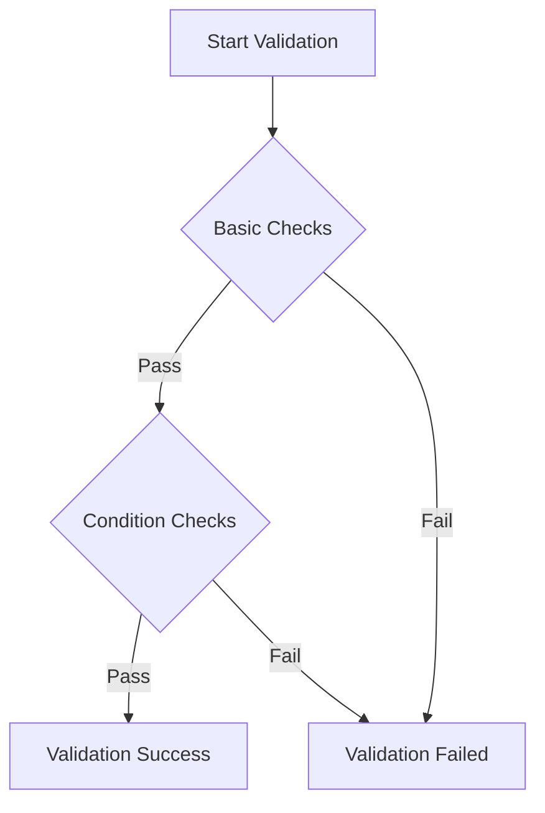
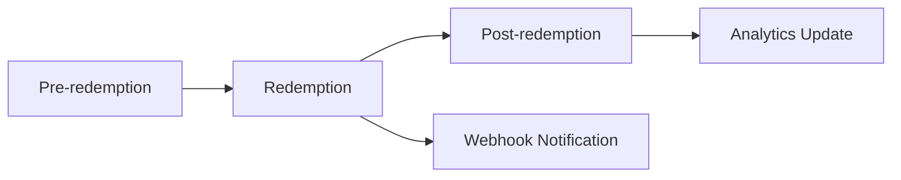
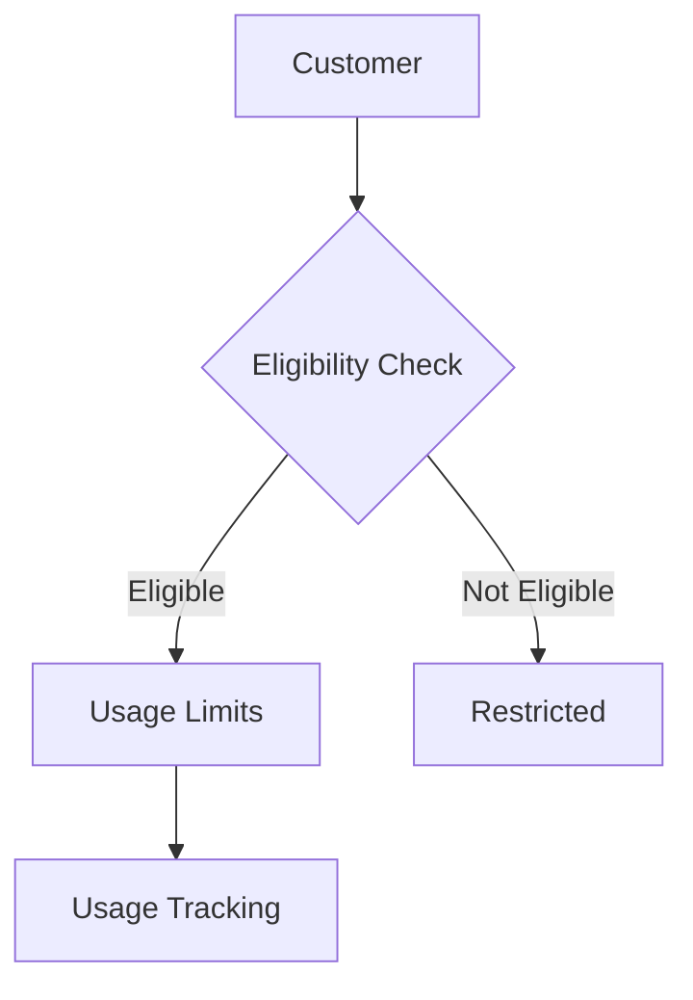
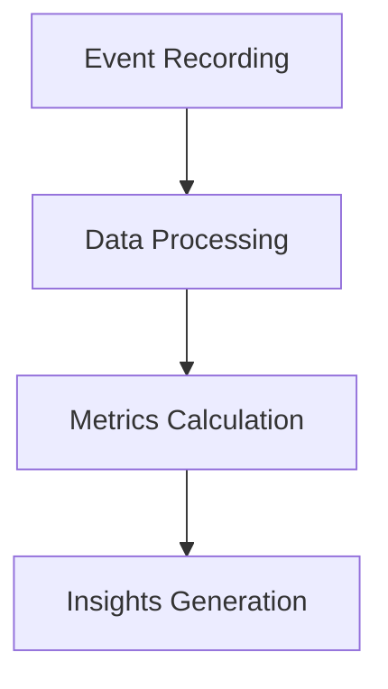

# Understanding Voucher API

This explanation helps you understand key concepts and principles behind Voucher API, how they relate to each other, and why they work the way they do.

## What is a voucher?

A voucher in our system represents a discount or promotional offer that can be applied to customer orders. Think of it as a digital coupon that contains all rules and conditions for applying a discount.

### Voucher anatomy

Every voucher consists of several key components that work together:

1. **Identity and Type**
   - Unique identifier (code or ID)
   - Discount type (percentage, fixed amount, or shipping)
   - These determine how the voucher is recognized and what kind of discount it provides

2. **Value and Limits**
   - Actual discount value (e.g., 10% or $20)
   - Maximum discount amounts
   - These define scope and impact of the discount

3. **Conditions and Rules**
   - When the voucher can be used
   - What it can be used for
   - Who can use it
   - These ensure the voucher is used appropriately

4. **Validity Period**
   - Start and end dates
   - Time restrictions
   - These control when the voucher is active

## How validation works

Validation is the process of checking whether a voucher can be used for a specific order. It's like a security guard that ensures all rules are followed before allowing a discount to be applied.

### Validation process

1. **Basic Checks**
   - Verifies the voucher exists and is active
   - Ensures the voucher hasn't expired
   - Confirms the voucher hasn't been used
   - These are the fundamental requirements

2. **Condition Checks**
   - Validates order value requirements
   - Checks item eligibility
   - Verifies customer restrictions
   - These ensure the voucher is used correctly

## Redemption lifecycle

Redemption is the process of actually using a voucher. It's like a transaction that converts a voucher into an actual discount.

### Redemption journey

1. **Pre-redemption Phase**
   - Final validation checks
   - Discount calculation
   - This ensures everything is ready for redemption

2. **Redemption Phase**
   - Marks the voucher as used
   - Records the transaction
   - This is the actual application of the discount

3. **Post-redemption Phase**
   - Updates analytics
   - Triggers customer events
   - This maintains the system's state

## Customer management explained

Customer management is about understanding and controlling how customers interact with vouchers. It's like a set of rules that ensure fair and effective use of discounts.

### Customer interaction model

1. **Eligibility System**
   - Customer segmentation
   - Usage history tracking
   - Purchase history analysis
   - This determines who can use vouchers

2. **Usage Control**
   - Per-customer limits
   - Time-based restrictions
   - Value-based controls
   - This prevents abuse and ensures fair use

## Analytics and insights

Analytics in Voucher API provides insights into how vouchers are being used and their impact on your business.

### Analytics ecosystem

1. **Usage Analytics**
   - Tracks redemption rates
   - Measures discount impact
   - Monitors customer engagement
   - This helps understand voucher effectiveness

2. **Performance Analytics**
   - Monitors system performance
   - Tracks error rates
   - Measures response times
   - This ensures system reliability

## Why these concepts matter

Understanding these core concepts is crucial because:

1. **System Design**
   - Helps you design effective voucher strategies
   - Enables proper implementation
   - Guides decision-making

2. **Problem Solving**
   - Makes troubleshooting easier
   - Helps identify issues
   - Guides solution development

3. **Business Impact**
   - Enables better voucher management
   - Improves customer experience
   - Optimizes discount strategies

## Next steps

- Review [quick start guide](quick-start.md) to see these concepts in action
- Check [authentication guide](authentication.md) to understand security
- See [error codes](../../reference/errors.md) for troubleshooting
