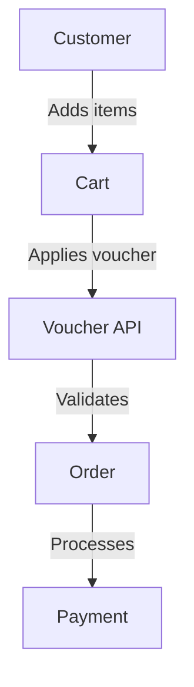
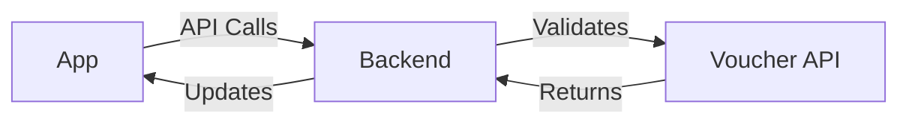

# Integration Patterns

This reference document outlines best practices and common patterns for integrating Voucher API into your applications.

## Common Integration Scenarios

### E-commerce Integration



1. **Cart Integration**
   - Validate vouchers during cart updates
   - Apply discounts in real-time
   - Handle multiple vouchers

2. **Checkout Flow**
   - Validate final order
   - Apply confirmed discount
   - Record redemption

### Mobile App Integration



1. **API Integration**
   - Use SDKs for native platforms
   - Handle offline scenarios
   - Implement retry logic

2. **User Experience**
   - Show real-time validation
   - Display discount preview
   - Handle errors gracefully

## Implementation Examples

=== "JavaScript"

    ```javascript
    import { VouchersAPI } from '@voucher/vouchers-sdk';

    const vouchers = new VouchersAPI({
      apiKey: 'your-api-key'
    });

    // Create a webhook handler
    const webhookHandler = vouchers.createWebhookHandler({
      secret: 'your-webhook-secret'
    });

    // Handle incoming webhook events
    app.post('/webhooks/voucher', async (req, res) => {
      try {
        const event = await webhookHandler.verify(req.body, req.headers['x-voucher-signature']);
        
        switch (event.type) {
          case 'voucher.created':
            console.log('New voucher created:', event.data);
            break;
          case 'voucher.applied':
            console.log('Voucher applied:', event.data);
            break;
        }
        
        res.status(200).send('Webhook processed');
      } catch (error) {
        console.error('Webhook error:', error);
        res.status(400).send('Invalid webhook');
      }
    });
    ```

=== "Node.js"

    ```javascript
    const { VouchersAPI } = require('@voucher/vouchers-sdk');
    const express = require('express');
    const app = express();

    const vouchers = new VouchersAPI({
      apiKey: 'your-api-key'
    });

    // Create a webhook handler
    const webhookHandler = vouchers.createWebhookHandler({
      secret: 'your-webhook-secret'
    });

    // Handle incoming webhook events
    app.post('/webhooks/voucher', async (req, res) => {
      try {
        const event = await webhookHandler.verify(req.body, req.headers['x-voucher-signature']);
        
        switch (event.type) {
          case 'voucher.created':
            console.log('New voucher created:', event.data);
            break;
          case 'voucher.applied':
            console.log('Voucher applied:', event.data);
            break;
        }
        
        res.status(200).send('Webhook processed');
      } catch (error) {
        console.error('Webhook error:', error);
        res.status(400).send('Invalid webhook');
      }
    });
    ```

## Best Practices

1. **Error Handling**
   - Implement proper error handling
   - Use retry mechanisms
   - Log validation failures

2. **Performance**
   - Cache validation results
   - Use batch operations
   - Implement rate limiting

3. **Security**
   - Validate server-side
   - Use secure API keys
   - Implement proper authentication

## See Also

- [Complex Discount Types](../guides/complex-discounts.md)
- [Analytics Integration](../api-reference/analytics.md)
- [Error Handling](../reference/errors.md)
- [API Reference](../api-reference/vouchers.md)
- [Webhook Documentation](../reference/webhooks.md)
- [Rate Limits](../reference/rate-limits.md)
- [Voucher Discount Best Practices](../explanation/voucher-discount-best-practices.md)